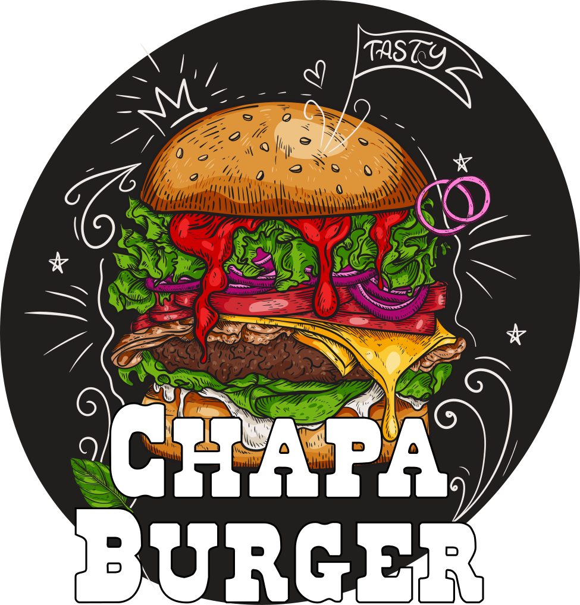

<!--  -->

# **Burger Queen API Client**

    
    
    
    
    
    
    
     
    

**Autoria:** [Clarissa Simplício](https://github.com/clasimplicio) e [Karla Oliveira](https://github.com/kabianca)

**Status do Projeto:** _Em andamento_ 

## **Índice**

* [1. Apresentação](#1-apresentação)
    * [1.1 Problema](#11-problema)
    * [1.2 Informações sobre o cliente](#12-informações-sobre-o-cliente)
* [2. Idealização do Projeto](#2-idealização-do-projeto)
* [3. Desenho de interface do usuário](#3-desenho-de-interface-do-usuário)
  * [3.1 Protótipo de baixa fidelidade](#31-protótipos-de-baixa-fidelidade)
  * [3.1 Protótipo de alta fidelidade](#32-protótipo-de-alta-fidelidade)
* [4. Historias de usuario](#4-histórias-de-usuário)
    * [4.1 Definição de produto](#41-definição-do-produto)
        * [4.1.1 Historia 1](#411-história-1-garçomgarçonete-deve-poder-entrar-no-sistema)
        * [4.1.2 Historia 2](#412-história-2-garçomgarçonete-deve-ser-capaz-de-anotar-o-pedido-do-cliente)
        * [4.1.3 Historia 3](#413-história-3-chefe-de-cozinha-deve-ver-os-pedidos)
        * [4.1.4 Historia 4](#414-história-4-garçomgarçonete-deve-ver-os-pedidos-prontos-para-servir)
* [5. Estrutura de apresentação](#5-estrutura-de-apresentação)
* [6. Hacker Edition](#6-hacker-edition)
* [7. Objetivos de aprendizagem](#7-objetivos-de-aprendizagem)
* [8. Fonte das imagens](#8-fonte-das-imagens)

## **1. Apresentação**

Quarto projeto realizado no [Bootcamp de Desenvolvimento Web da Laboratória](https://www.laboratoria.la/br) e teve como objetivo principal consolidar metodologias de trabalho em equipe, [desenvolvimento ágil](https://agilemanifesto.org/), [user centricity](https://uxplanet.org/ucd-vs-ux-whats-the-difference-255443efa5f), product design, research, versionamento de código, além de introduzir o uso do framework [React](https://reactjs.org/) e principios de [integração](https://medium.com/dailyjs/the-deepest-reason-why-modern-javascript-frameworks-exist-933b86ebc445) entre interface e API.

Para acessar o resultado final, clique aqui.

| **Função** | **login** | **senha** |
| :---------- | :----------: | ----------:|
| Atendimento | servico@teste.com | 123456 |
| Cozinha | cozinha@teste.com | 123456 |

### **1.1 Problema**

Um pequeno restaurante de hambúrgueres, que está crescendo, necessita uma interface em que se possa realizar pedidos utilizando um tablet, e enviá-los para a cozinha para que sejam preparados de forma ordenada e eficiente. Este projeto tem duas áreas: interface (cliente) e API (servidor). Nosso cliente nos pediu para desenvolver uma interface que se integre com a API.

Esse é um projeto 100% por demanda, embora seja possível (e aconselhável) fazer sugestões de melhora e mudança, prioritariamente nos asseguramos de cumprir os requisitos solicitados.

### **1.2 Informações sobre o cliente:**

> Burger Queen, um fast food cuja proposta de serviço 24 horas foi muito bem recebida e, para continuar a crescer, precisa de um sistema que ajude a receber pedidos de nossos clientes.

A interface deve mostrar os dois menus (café da manhã e restante do dia), cada um com todos os seus produtos. O usuário deve poder escolher que produtos adicionar e a interface deve mostrar o resumo do pedido com o custo total.

## **2. Idealização do Projeto**

O planejamento desse projeto foi realizado de modo integral com auxílio [GitHub Projects](https://docs.github.com/pt/issues/planning-and-tracking-with-projects/learning-about-projects/about-projects), onde foi possível agrupar problemas e acompanhar as solicitações e aprovações de Pull Requests associados à resolução desses problemas e tudo isso disposto de maneira bastante intuitiva em um [Kanban Dashboard](https://kanbanize.com/kanban-resources/getting-started/what-is-kanban-board). Além disso, tornou possível visualizar o andamento do trabalho com gráficos configuráveis e trabalhar com milestones (marcos).

## **3. Desenho de interface do usuário**
A interface foi projetada e implementada para ser usada em tablets, por isso optou-se pelo uso de botões e elementos com áreas clicáveis amplas.

### **3.1 Protótipos de baixa fidelidade**

### **3.2 Protótipo de alta fidelidade**

## **4. Histórias de usuário**

### **4.1 Definição do produto**

O [Product Owner](https://www.youtube.com/watch?v=7lhnYbmovb4) nos apresentou este backlog que é o resultado do seu trabalho com o cliente até hoje.

#### **4.1.1 História 1: Garçom/Garçonete deve poder entrar no sistema**

> Eu, como garçom/garçonete quero entrar no sistema de pedidos.

* **Critérios de aceitação**
   - [x] Acessar uma tela de login.
   - [x] Inserir email e senha.
   - [x] Receber mensagens de erros compreensíveis, conforme o erro e as informações inseridas.
   - [x] Entrar no sistema de pedidos caso as credenciais forem corretas.

* **Definição de pronto**

   - [x] _Code review_ de uma parceira.
   - [ ] Testes unitários e testes manuais.
   - [x] Testes de usabilidade e incorporação de feedback de usuário.
   - [x] Deploy do aplicativo e marcação de versão (tag git).

#### **4.1.2 História 2: Garçom/Garçonete deve ser capaz de anotar o pedido do cliente**

> Eu como garçom/garçonete quero poder anotar o pedido de um cliente para não depender da minha memória, saber quanto cobrar e poder enviar os pedidos para a cozinha para serem preparados em ordem.

* **Critérios de aceitação**

    - [x] Anotar o nome do cliente.
    - [x] Adicionar produtos aos pedidos.
    - [x] Excluir produtos.
    - [x] Ver resumo e o total da compra.
    - [ ] Enviar o pedido para a cozinha (guardar em algum banco de dados).
    - [x] Funcionar bem em um tablet.

* **Definição de pronto**

   - [ ] _Code review_ de uma parceira.
   - [ ] Testes unitários e testes manuais.
   - [ ] Testes de usabilidade e incorporação de feedback de usuário.
   - [ ] Deploy do aplicativo e marcação de versão (tag git).

#### **4.1.3 História 3: Chefe de cozinha deve ver os pedidos**

> Eu como chefe de cozinha quero ver os pedidos dos clientes em ordem, poder marcar que estão prontos e poder notificar os garçons/garçonetes que o pedido está pronto para ser entregue ao cliente.

* **Critérios de aceitação**

    - [ ] Ver os pedidos ordenados à medida em que são feitos.
    - [ ] Marcar os pedidos que foram preparados e estão prontos para serem servidos.
    - [ ] Ver o tempo que levou para preparar o pedido desde que chegou, até ser marcado como concluído.

* **Definição de pronto**
   
   - [ ] _Code review_ de uma parceira.
   - [ ] Testes unitários e testes manuais.
   - [ ] Testes de usabilidade e incorporação de feedback de usuário.
   - [ ] Deploy do aplicativo e marcação de versão (tag git).

#### **4.1.4 História 4: Garçom/Garçonete deve ver os pedidos prontos para servir**

> Eu como garçom/garçonete quero ver os pedidos que estão prontos para entregá-los rapidamente aos clientes.

* **Critérios de aceitação**

    - [ ] Ver a lista de pedidos prontos para servir.
    - [ ] Marcar os pedidos que foram entregues.

* **Definição de pronto**

   - [ ] _Code review_ de uma parceira.
   - [ ] Testes unitários e testes manuais.
   - [ ] Testes de usabilidade e incorporação de feedback de usuário.
   - [ ] Deploy do aplicativo e marcação de versão (tag git).
   - [ ] Os dados devem ser mantidos intactos, mesmo depois que um pedido for finalizado. Tudo isso para poder ter estatísticas no futuro.

## **5. Estrutura de apresentação**

## **6. Hacker edition**

As seções chamadas Hacker Edition são opcionais. Se você terminou tudo e ainda sobrou tempo, faça essa parte. Assim você poderá aprofundar e exercitar mais sobre os objetivos de aprendizagem do projeto.

A aplicação deve seguir 80% ou mais das pontuações de Performance, Progressive Web App, Accessibility e Best Practices do [Lighthouse](https://developers.google.com/web/tools/lighthouse/).

## **7. Objetivos de aprendizagem priorizados**
| **JavaScript** | **HTTP** | **react** |
| :---------- | :----------: | ----------:|
| Testes unitários | Solicitações o requisições (request) e respostas (response). | jsx |
| Testes assíncronos | Cabeçalhos (headers) | components |
| Mocking | Corpo (body) | events |
| | Verbos HTTP | lists-and-keys |
| | Codigos de status de HTTP | conditional-rendering |
| | Encodings e JSON | lifting-up-state |
| | CORS (Cross-Origin Resource Sharing) | hooks |
| | | css-modules |
| | | routing |
## **8. Fonte das imagens**

Logo hamburger adaptado de: <a href="https://www.freepik.com/free-vector/burger-fast-food-concept-hand-drawn-sketch-vector-illustration_26935569.htm#query=hamburger&position=7&from_view=search&track=sph">Image by nuraghies</a> on Freepik

Icones do cardápio: <a href="https://www.flaticon.com/authors/freepik" title="Freepik icons">Icons created by Freepik - Flaticon</a> (chicken, vegan, hamburger, hamburger double, coffee, milk coffee, onion rings, french-fries, drink, water, egg, orange juice)

Cheese slice: <a href="https://www.flaticon.com/free-icons/cheese-slice" title="cheese slice icons">Cheese slice icons created by Erifqi Zetiawan - Flaticon</a>

Sandwich: <a href="https://www.flaticon.com/free-icons/sandwich" title="sandwich icons">Sandwich icons created by Flat Icons - Flaticon</a>

